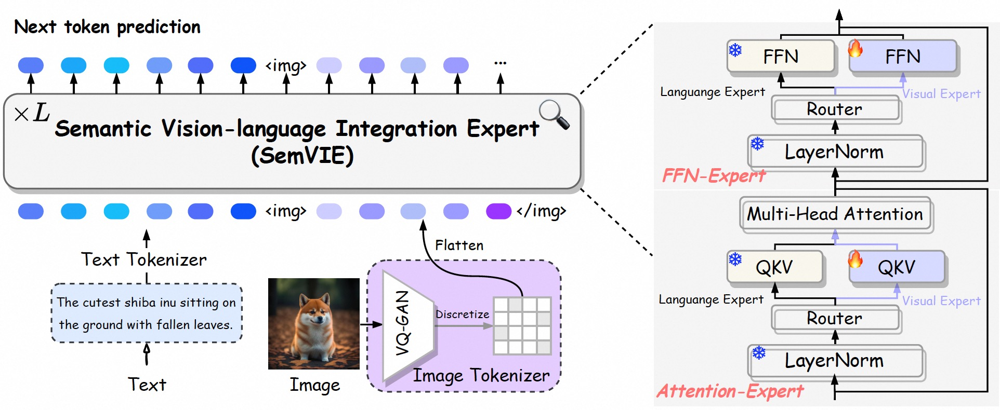

<!-- ## <div align="center"> <i>MARS</i>: Mixture of Auto-Regressive Models for Fine-grained Text-to-image Synthesis </div>

<div align="center">

  
  <a href="https://arxiv.org/pdf/2407.07614v1"></a> &ensp;

</div>

--- -->


<!-- # magic-edit.github.io -->

<p align="center">
  <h2 align="center">MARS: Mixture of Auto-Regressive Models for Fine-grained Text-to-image Synthesis</h2>
  <p align="center">
    <a><strong>Wanggui He, <sup>1,*</sup> </strong></a>
    <a href="https://github.com/fusiming3"><strong>Siming Fu, <sup>1,*</sup> </strong></a>
    <a href="https://xiaobul.github.io/"><strong>Mushui Liu, <sup>2,*</sup> </strong></a>
    <a><strong>Xierui Wan, <sup>2,+</sup> </strong></a>
    <a><strong>Wenyi Xiao, <sup>2,+</sup> </strong></a>
    <a><strong>Fangxun Shu, <sup>1,+</sup> </strong></a>
    <a><strong>Yi Wang, <sup>2</sup> </strong></a>
    <a><strong>Lei Zhang, <sup>2</sup> </strong></a>
    <a><strong>Zhelun Yu, <sup>3</sup> </strong></a>
    <a><strong> Haoyuan Li, <sup>2</sup> </strong></a>
    <a><strong>Ziwei Huang, <sup>2</sup> </strong></a>
    <a><strong>LeiLei Gan, <sup>2</sup> </strong></a>
    <a><strong>Hao Jiang, <sup>1,†</sup> </strong></a>
    <br>
    <sup>1</sup> Alibaba Group&nbsp;&nbsp;&nbsp;&nbsp;&nbsp;&nbsp;<sup>2</sup> Zhejiang University&nbsp;&nbsp;&nbsp;&nbsp;&nbsp;&nbsp;<sup>3</sup> Fudan University
    <br>
    <br>
    *Equal contribution +Core contributor †Corresponding author
    </br>
    </br>
        <a href="https://arxiv.org/pdf/2407.07614v1">
        </a>
  </p>
</p>


<!-- <p align="center"><b>We will release the code soon!</b></p> -->


## Overview


This repository contains the official implementation of the paper "MARS: Mixture of Auto-Regressive Models for Fine-grained Text-to-image Synthesis".

Auto-regressive models have made significant progress in the realm of language generation, yet do not perform on par with diffusion models in the domain of image synthesis. In this work, we introduce MARS, a novel framework for T2I generation that incorporates a specially designed Semantic Vision-Language Integration Expert (SemVIE). This innovative component integrates pre-trained LLMs by independently processing linguistic and visual information—freezing the textual component while fine-tuning the visual component. This methodology preserves the NLP capabilities of LLMs while imbuing them with exceptional visual understanding. Building upon the powerful base of the pre-trained Qwen-7B, MARS stands out with its bilingual generative capabilities corresponding to both English and Chinese language prompts and the capacity for joint image and text generation.   The flexibility of this framework lends itself to migration towards any-to-any task adaptability. Furthermore, MARS employs a multi-stage training strategy that first establishes robust image-text alignment through complementary bidirectional tasks and subsequently concentrates on refining the T2I generation process, significantly augmenting text-image synchrony and the granularity of image details.  Notably, MARS requires only 9% of the GPU days needed by SD1.5, yet it achieves remarkable results across a variety of benchmarks, illustrating the training efficiency and the potential for swift deployment in various applications.



## Getting Started

### Setup

```bash
git clone https://github.com/fusiming3/MARS.git   
cd MARS
pip install -r requirements.txt
```

### Model


Download our checkpoint from [MARS].

### Inference

```bash
run inference.ipynb
```


## Todo List

- [x] paper
- [ ] inference code
- [ ] model weights
- [ ] training code


## Acknowledgement

This repository is built based on the fancy, robust, and extensible work of [Qwen](https://github.com/QwenLM/Qwen) and [muse](https://github.com/huggingface/open-muse). We also thank HuggingFace for their contribution to the open source community.

